# Health Card Application System - Sequence Diagrams (Capstone Documentation)

> **Documentation Purpose:** This document provides comprehensive sequence diagrams for all major workflows in the Health Card Application System, including the new renewal feature.

---

## 📋 Table of Contents

1. [New Application Flow](#1-new-application-flow)
2. [Renewal Application Flow](#2-renewal-application-flow-new)
3. [Document Review Process](#3-document-review-process)
4. [Payment Processing](#4-payment-processing)
5. [Orientation Booking](#5-orientation-booking)
6. [Health Card Issuance](#6-health-card-issuance)
7. [Renewal Eligibility Check](#7-renewal-eligibility-check-new)

---

## 1. New Application Flow

### Complete New Application Process

```mermaid
sequenceDiagram
    actor User
    participant Mobile as Mobile App
    participant Convex as Convex Backend
    participant Storage as Convex Storage
    participant Admin as WebAdmin
    
    Note over User,Admin: Phase 1: Application Submission
    
    User->>Mobile: Opens "Apply" screen
    Mobile->>Convex: Query jobCategories
    Convex-->>Mobile: Return available categories
    Mobile-->>User: Display job categories
    
    User->>Mobile: Selects category & fills form
    Note over User,Mobile: Personal details, position, organization
    
    User->>Mobile: Clicks "Next" (Review)
    Mobile->>Mobile: Validates form data
    
    User->>Mobile: Clicks "Submit Application"
    Mobile->>Convex: createApplication mutation
    Note over Convex: Creates application with status "Draft"
    Convex-->>Mobile: Return applicationId
    Mobile-->>User: Show "Application Created"
    
    Note over User,Admin: Phase 2: Document Upload
    
    User->>Mobile: Opens Document Upload
    Mobile->>Convex: Query required documents for category
    Convex-->>Mobile: Return document types
    
    loop For each required document
        User->>Mobile: Selects file from device
        Mobile->>Storage: Upload file
        Storage-->>Mobile: Return storageFileId
        Mobile->>Convex: createDocumentUpload mutation
        Note over Convex: Creates upload with status "Pending"
        Convex-->>Mobile: Confirm upload saved
    end
    
    User->>Mobile: Clicks "Submit for Review"
    Mobile->>Convex: updateApplicationStatus mutation
    Note over Convex: Status: "Draft" → "Submitted"
    Convex->>Convex: Create notification for admin
    Convex-->>Mobile: Confirm submission
    Mobile-->>User: Show "Application Submitted"
    
    Note over User,Admin: Phase 3: Admin Document Review
    
    Admin->>Convex: Query pending applications
    Convex-->>Admin: Return applications with "Submitted" status
    
    Admin->>Admin: Reviews application details
    Admin->>Convex: Query document uploads
    Convex-->>Admin: Return uploaded documents
    
    alt Documents Approved
        Admin->>Convex: approveDocuments mutation
        Note over Convex: Updates reviewStatus: "Pending" → "Approved"
        Convex->>Convex: Update application status
        Note over Convex: Status: "Submitted" → "For Payment Validation"
        Convex->>Convex: Create notification for user
        Convex-->>Admin: Confirm approval
        
        Convex->>Mobile: Push notification
        Mobile-->>User: "Documents approved, proceed to payment"
        
    else Documents Need Revision
        Admin->>Convex: rejectDocument mutation
        Note over Convex: Creates documentReferralHistory record
        Note over Convex: issueType: "document_issue"
        Convex->>Convex: Update application status
        Note over Convex: Status: "Submitted" → "Documents Need Revision"
        Convex->>Convex: Create notification for user
        Convex-->>Admin: Confirm rejection
        
        Convex->>Mobile: Push notification
        Mobile-->>User: "Document needs revision"
        User->>Mobile: Re-uploads corrected document
        Mobile->>Convex: createDocumentUpload mutation
        Note over Convex: Links to previous via replacementUploadId
        
    else Medical Referral Required
        Admin->>Convex: referDocument mutation
        Note over Convex: Creates documentReferralHistory record
        Note over Convex: issueType: "medical_referral"
        Convex->>Convex: Update application status
        Note over Convex: Status: "Submitted" → "Referred for Medical Management"
        Convex->>Convex: Create notification for user
        Convex-->>Admin: Confirm referral
        
        Convex->>Mobile: Push notification
        Mobile-->>User: "Medical consultation required"
    end
    
    Note over User,Admin: Phase 4: Payment
    
    User->>Mobile: Opens Payment screen
    Mobile->>Convex: Query payment details
    Convex-->>Mobile: Return amount (₱60)
    Mobile-->>User: Display payment options
    alt Online Payment (Maya)
        User->>Mobile: Selects "Pay with Maya"
        Mobile->>Convex: createPayment mutation
        Note over Convex: Creates payment with status "Pending"
        Convex->>Maya: Create checkout session
        Maya-->>Convex: Return checkout URL
        Convex-->>Mobile: Return checkout URL
        Mobile->>Maya: Opens Maya checkout
        User->>Maya: Completes payment
        Maya->>Convex: Webhook: payment_success
        Note over Convex: Updates payment status to "Complete"
        Convex->>Convex: Create paymentLog
        Convex->>Convex: Create notification for user
        Convex->>Mobile: Push notification
        Mobile-->>User: "Payment successful"
        
    else Manual Payment (Barangay/City Hall)
        User->>Mobile: Selects "Pay at Barangay Hall"
        Mobile-->>User: Show payment instructions
        User->>User: Makes payment at hall
        User->>Mobile: Uploads receipt
        Mobile->>Storage: Upload receipt
        Storage-->>Mobile: Return storageFileId
        Mobile->>Convex: createManualPayment mutation
        Note over Convex: Creates payment with status "Pending"
        Convex->>Convex: Create notification for admin
        Convex-->>Mobile: Confirm submission
        Mobile-->>User: "Receipt submitted for validation"
    end
    
    Note over User,Admin: Phase 5: Payment Validation (Manual Only)
    
    Admin->>Convex: Query pending payments
    Convex-->>Admin: Return payments with "Pending" status
    
    alt Payment Approved
        Admin->>Convex: approvePayment mutation
        Note over Convex: Status: "Pending" → "Complete"
        Convex->>Convex: Update application status
        Note over Convex: Status: "For Payment Validation" → next phase
        Convex->>Convex: Create notification for user
        Convex-->>Admin: Confirm approval
        
    else Payment Rejected
        Admin->>Convex: rejectPayment mutation
        Note over Convex: Creates paymentRejectionHistory record
        Note over Convex: Payment status: "Pending" → "Failed"
        Convex->>Convex: Create notification for user
        Convex-->>Admin: Confirm rejection
    end
    
    Note over User,Admin: Phase 6: Orientation (if required)
    
    alt Job Category Requires Orientation
        Convex->>Convex: Check jobCategory.requireOrientation
        Convex->>Convex: Update application status
        Note over Convex: Status → "For Orientation"
        Convex->>Mobile: Push notification
        Mobile-->>User: "Book orientation session"
        
        User->>Mobile: Opens Orientation Booking
        Mobile->>Convex: Query available schedules
        Convex-->>Mobile: Return orientationSchedules
        Mobile-->>User: Display available dates/times
        
        User->>Mobile: Selects schedule
        Mobile->>Convex: createOrientationBooking mutation
        Note over Convex: Creates booking with status "scheduled"
        Note over Convex: Decrements availableSlots
        Convex->>Convex: Generate QR code
        Convex-->>Mobile: Return booking + QR code
        Mobile-->>User: Show booking confirmation + QR
        
        User->>User: Attends orientation session
        User->>Mobile: Shows QR code to inspector
        
        Admin->>Mobile: Scans QR code (Inspector app)
        Mobile->>Convex: checkInUser mutation
        Note over Convex: Status: "scheduled" → "checked-in"
        Note over Convex: Records checkInTime
        Convex-->>Mobile: Confirm check-in
        
        Note over User: Attends orientation (2 hours)
        
        Admin->>Mobile: Scans QR code again
        Mobile->>Convex: checkOutUser mutation
        Note over Convex: Status: "checked-in" → "completed"
        Note over Convex: Records checkOutTime
        Convex->>Convex: Update application.orientationCompleted = true
        Convex-->>Mobile: Confirm check-out
        
    else No Orientation Required
        Note over Convex: Skip orientation phase
    end
    
    Note over User,Admin: Phase 7: Final Approval & Health Card Issuance
    
    Admin->>Convex: Query ready-to-approve applications
    Convex-->>Admin: Return applications (all requirements met)
    
    Admin->>Admin: Final review
    Admin->>Convex: approveApplication mutation
    Note over Convex: Generate unique registration number
    Note over Convex: Generate health card HTML
    Convex->>Convex: Create healthCard record
    Note over Convex: Status: "active"
    Note over Convex: Set issuedDate, expiryDate (1 year)
    Convex->>Convex: Update application status
    Note over Convex: Status → "Approved"
    Note over Convex: Link healthCardId to application
    Convex->>Convex: Create notification for user
    Convex-->>Admin: Confirm approval
    
    Convex->>Mobile: Push notification
    Mobile-->>User: "Health card issued!"
    
    User->>Mobile: Opens "My Health Cards"
    Mobile->>Convex: Query user's health cards
    Convex-->>Mobile: Return health cards
    Mobile-->>User: Display health card with QR code
```

---

## 2. Renewal Application Flow (NEW)

### Complete Renewal Process

---

## 3. Document Review Process

### Detailed Document Verification Flow

```mermaid
sequenceDiagram
    actor Admin
    participant WebAdmin
    participant Convex as Convex Backend
    participant Mobile as Mobile App
    actor User
    
    Admin->>WebAdmin: Opens "Document Verification" dashboard
    WebAdmin->>Convex: Query applications needing review
    Note over WebAdmin,Convex: Filter: status = "Submitted"
    Convex-->>WebAdmin: Return pending applications
    
    Admin->>WebAdmin: Selects application to review
    WebAdmin->>Convex: Query application details
    Convex-->>WebAdmin: Return application data
    WebAdmin->>Convex: Query document uploads
    Convex-->>WebAdmin: Return uploaded documents
    
    WebAdmin-->>Admin: Display documents for review
    
    loop For each document
        Admin->>WebAdmin: Clicks document to view
        WebAdmin->>Convex: getDocumentAccessUrl query
        Note over Convex: Generate HMAC-signed URL
        Convex-->>WebAdmin: Return signed URL
        WebAdmin->>Admin: Display document in viewer
        
        alt Document Approved
            Admin->>WebAdmin: Clicks "Approve"
            WebAdmin->>Convex: approveDocument mutation
            Note over Convex: reviewStatus: "Pending" → "Approved"
            Note over Convex: Set reviewedBy, reviewedAt
            Convex->>Convex: Create adminActivityLog
            Convex-->>WebAdmin: Confirm approval
            
        else Non-Medical Issue (Needs Revision)
            Admin->>WebAdmin: Clicks "Mark for Revision"
            Admin->>WebAdmin: Selects issue category
            Note over Admin: e.g., "blurry_photo", "expired_document"
            Admin->>WebAdmin: Enters detailed reason
            Admin->>WebAdmin: Lists specific issues
            
            WebAdmin->>Convex: createDocumentReferral mutation
            Note over Convex: issueType: "document_issue"
            Note over Convex: documentIssueCategory: <selected>
            Convex->>Convex: Create documentReferralHistory record
            Convex->>Convex: Preserve original file (audit)
            Convex->>Convex: Update reviewStatus: "NeedsRevision"
            Convex->>Convex: Create adminActivityLog
            Convex->>Convex: Create notification for user
            Convex-->>WebAdmin: Confirm referral
            
            Convex->>Mobile: Push notification
            Mobile-->>User: "Document needs revision"
            
            User->>Mobile: Views rejection details
            Mobile->>Convex: Query documentReferralHistory
            Convex-->>Mobile: Return reason + specific issues
            Mobile-->>User: Display detailed feedback
            
            User->>Mobile: Re-uploads corrected document
            Mobile->>Convex: createDocumentUpload mutation
            Note over Convex: Link via replacementUploadId
            Note over Convex: Increment attemptNumber
            Convex->>Convex: Update referralHistory.wasReplaced = true
            Convex-->>Mobile: Confirm upload
            
        else Medical Finding (Referral)
            Admin->>WebAdmin: Clicks "Refer for Medical Management"
            Admin->>WebAdmin: Selects medical category
            Note over Admin: e.g., "abnormal_xray", "positive_drug_test"
            Admin->>WebAdmin: Enters clinical findings
            Admin->>WebAdmin: Enters doctor info (optional)
            
            WebAdmin->>Convex: createMedicalReferral mutation
            Note over Convex: issueType: "medical_referral"
            Note over Convex: medicalReferralCategory: <selected>
            Convex->>Convex: Create documentReferralHistory record
            Convex->>Convex: Update reviewStatus: "Referred"
            Convex->>Convex: Update application status
            Note over Convex: Status → "Referred for Medical Management"
            Convex->>Convex: Create adminActivityLog
            Convex->>Convex: Create notification for user
            Convex-->>WebAdmin: Confirm referral
            
            Convex->>Mobile: Push notification
            Mobile-->>User: "Medical consultation required"
            
            User->>Mobile: Views referral details
            Mobile->>Convex: Query documentReferralHistory
            Convex-->>Mobile: Return medical findings + doctor info
            Mobile-->>User: Display referral information
            Note over User: User seeks medical consultation
            Note over User: Gets treatment/clearance
        end
    end
    
    Admin->>WebAdmin: Reviews all documents
    
    alt All Documents Approved
        WebAdmin->>Convex: Check document approval status
        Convex->>Convex: Update application status
        Note over Convex: Status: "Submitted" → "For Payment Validation"
        Convex->>Convex: Set paymentDeadline (7 days)
        Convex->>Convex: Create notification for user
        Convex-->>WebAdmin: Confirm status update
        
        Convex->>Mobile: Push notification
        Mobile-->>User: "Documents approved! Proceed to payment"
        
    else Some Documents Need Revision
        Convex->>Convex: Keep status "Documents Need Revision"
        Convex->>Convex: Wait for user resubmission
        
    else Medical Referral Required
        Convex->>Convex: Keep status "Referred for Medical Management"
        Convex->>Convex: Application on hold until clearance
    end
```

---

## 4. Payment Processing

### Online Payment (Maya) Flow

```mermaid
sequenceDiagram
    actor User
    participant Mobile as Mobile App
    participant Convex as Convex Backend
    participant Maya as Maya Payment API
    
    User->>Mobile: Opens Payment screen
    Mobile->>Convex: Query payment requirements
    Note over Mobile,Convex: Pass applicationId
    Convex->>Convex: Calculate fees
    Note over Convex: Total: ₱60
    Convex-->>Mobile: Return amount details
    Mobile-->>User: Display payment options
    
    User->>Mobile: Selects "Pay with Maya"
    Mobile->>Convex: createMayaCheckout mutation
    
    Convex->>Convex: Create payment record
    Note over Convex: paymentStatus: "Pending"
    Note over Convex: paymentMethod: "Maya"
    Note over Convex: paymentProvider: "maya_api"
    
    Convex->>Maya: POST /checkout
    Note over Convex,Maya: Pass amount, redirectUrl, webhookUrl
    
    alt Maya API Success
        Maya-->>Convex: Return checkoutId + checkoutUrl
        Convex->>Convex: Update payment.mayaCheckoutId
        Convex->>Convex: Update payment.checkoutUrl
        Convex->>Convex: Create paymentLog (checkout_created)
        Convex-->>Mobile: Return checkoutUrl
        
        Mobile->>Maya: Opens Maya checkout page
        Mobile-->>User: Display Maya payment form
        
        User->>Maya: Enters payment details
        User->>Maya: Confirms payment
        
        Maya->>Maya: Process payment
        
        alt Payment Successful
            Maya->>Convex: Webhook: payment.success
            Note over Maya,Convex: POST /api/webhooks/maya
            
            Convex->>Convex: Verify webhook signature
            Convex->>Convex: Update payment status
            Note over Convex: paymentStatus: "Pending" → "Complete"
            Convex->>Convex: Set settlementDate
            Convex->>Convex: Create paymentLog (payment_success)
            Convex->>Convex: Update application status
            Note over Convex: Check if orientation required
            Convex->>Convex: Create notification for user
            Convex->>Convex: Create adminActivityLog
            Convex-->>Maya: Return 200 OK
            
            Maya->>Mobile: Redirect to successUrl
            Mobile->>Convex: Query payment status
            Convex-->>Mobile: Return "Complete"
            Mobile-->>User: Show "Payment Successful!"
            
        else Payment Failed
            Maya->>Convex: Webhook: payment.failed
            Convex->>Convex: Update payment status
            Note over Convex: paymentStatus: "Pending" → "Failed"
            Convex->>Convex: Store failureReason
            Convex->>Convex: Create paymentLog (payment_failed)
            Convex-->>Maya: Return 200 OK
            
            Maya->>Mobile: Redirect to failureUrl
            Mobile-->>User: Show "Payment Failed"
            Mobile-->>User: Option to retry
            
        else Payment Expired
            Maya->>Convex: Webhook: payment.expired
            Convex->>Convex: Update payment status
            Note over Convex: paymentStatus: "Pending" → "Expired"
            Convex->>Convex: Create paymentLog (payment_expired)
            Convex-->>Maya: Return 200 OK
        end
        
    else Maya API Error
        Maya-->>Convex: Return error
        Convex->>Convex: Create paymentLog (checkout_failed)
        Convex-->>Mobile: Return error
        Mobile-->>User: Show error message
    end
```

### Manual Payment Flow

---

## 5. Orientation Booking

### Complete Orientation Flow

---

## 6. Health Card Issuance

### Final Approval & Card Generation

```mermaid
sequenceDiagram
    actor Admin
    participant WebAdmin
    participant Convex as Convex Backend
    participant Mobile as Mobile App
    actor User
    
    Note over Admin,User: Prerequisites Check
    
    Admin->>WebAdmin: Opens "Ready for Approval" dashboard
    WebAdmin->>Convex: Query applications ready for approval
    Note over WebAdmin,Convex: Filter applications where:
    Note over WebAdmin,Convex: - All documents approved
    Note over WebAdmin,Convex: - Payment complete
    Note over WebAdmin,Convex: - Orientation done (if required)
    
    Convex-->>WebAdmin: Return eligible applications
    WebAdmin-->>Admin: Display applications list
    
    Admin->>WebAdmin: Selects application to approve
    WebAdmin->>Convex: Query full application details
    Convex-->>WebAdmin: Return application, documents, payment
    
    Admin->>Admin: Final review of all details
    Admin->>WebAdmin: Clicks "Approve & Issue Health Card"
    
    Note over Admin,User: Health Card Generation
    
    WebAdmin->>Convex: approveApplicationAndIssueCard mutation
    
    Convex->>Convex: Generate unique registration number
    Note over Convex: Format: CHO-YYYY-XXXXXX
    Note over Convex: e.g., CHO-2025-001234
    
    Convex->>Convex: Get applicant details
    Note over Convex: Name, photo, job category, etc.
    
    Convex->>Convex: Generate health card HTML
    Note over Convex: Template includes:
    Note over Convex: - Registration number
    Note over Convex: - Applicant photo
    Note over Convex: - Personal details
    Note over Convex: - Job category color
    Note over Convex: - Issue/expiry dates
    Note over Convex: - QR code for verification
    
    Convex->>Convex: Create healthCard record
    Note over Convex: status: "active"
    Note over Convex: issuedDate: now
    Note over Convex: expiryDate: +1 year from now
    Note over Convex: htmlContent: <generated HTML>
    
    Convex->>Convex: Update application
    Note over Convex: applicationStatus → "Approved"
    Note over Convex: approvedAt: now
    Note over Convex: healthCardId: <new card ID>
    Note over Convex: healthCardRegistrationNumber: <number>
    Note over Convex: healthCardIssuedAt: now
    
    Convex->>Convex: Create notification for user
    Note over Convex: "Your health card has been issued!"
    
    Convex->>Convex: Create adminActivityLog
    Note over Convex: action: "health_card_issued"
    
    Convex-->>WebAdmin: Confirm issuance
    WebAdmin-->>Admin: Show "Health card issued"
    
    Convex->>Mobile: Push notification
    Mobile-->>User: "Health card issued! 🎉"
    
    Note over Admin,User: User Views Health Card
    
    User->>Mobile: Opens "My Health Cards" screen
    Mobile->>Convex: getUserHealthCards query
    Note over Mobile,Convex: Pass userId
    
    Convex->>Convex: Get user's applications
    Convex->>Convex: Get linked health cards
    Convex->>Convex: Join with job categories
    Convex-->>Mobile: Return health cards with details
    
    Mobile-->>User: Display health card(s)
    Note over User: Shows:
    Note over User: - Registration number
    Note over User: - Photo
    Note over User: - Job category badge
    Note over User: - Issue/expiry dates
    Note over User: - Status (Active/Expired)
    Note over User: - QR code
    
    User->>Mobile: Clicks "View Full Card"
    Mobile->>Convex: getHealthCardHTML query
    Convex-->>Mobile: Return card HTML content
    Mobile-->>User: Display rendered health card
    
    User->>Mobile: Clicks "Download Card"
    Mobile->>Mobile: Generate PDF from HTML
    Mobile->>Mobile: Save to device
    Mobile-->>User: "Health card saved"
    
    User->>Mobile: Clicks "Share Card"
    Mobile->>Mobile: Generate shareable image
    Mobile-->>User: Show share options
```

---

## 7. Renewal Eligibility Check (NEW)

### Detailed Eligibility Verification

---

## 📊 System Integration Overview

### High-Level System Architecture

---

## 📝 Sequence Diagram Notation Guide

### Actors & Participants
- **Actor** (User, Admin): Human users of the system
- **Participant** (Mobile, Convex): System components

### Arrow Types
- `->`: Synchronous call
- `-->`: Response/return
- `->>`: Asynchronous message
- `-->>`: Asynchronous response

### Boxes
- **Note**: Additional context or explanation
- **Alt**: Alternative paths (if/else)
- **Loop**: Repeated actions
- **Opt**: Optional actions

---

## 🔗 Related Documentation

- **Domain Diagram**: `CAPSTONE_DOMAIN_DIAGRAM.md` - Database schema and relationships
- **Renewal Implementation Guide**: `RENEWAL_MASTER_IMPLEMENTATION_GUIDE.md` - Step-by-step implementation
- **Convex Schema**: `C:\Em\backend\convex\schema.ts` - Actual schema definition

---

## 📅 Document Information

- **Version**: 1.0
- **Last Updated**: 2025-11-15
- **Created For**: Capstone Project Documentation
- **Covers**: Complete application flow + Renewal feature (NEW)

---

**End of Sequence Diagrams**
