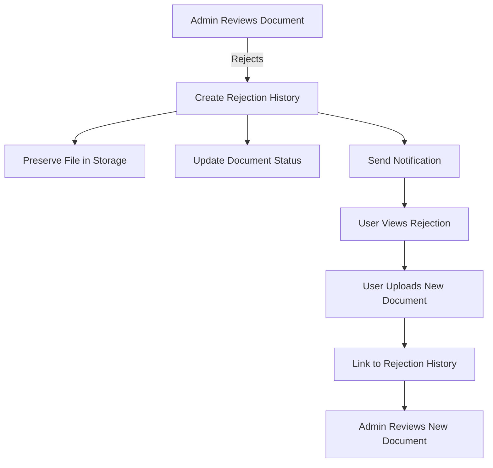
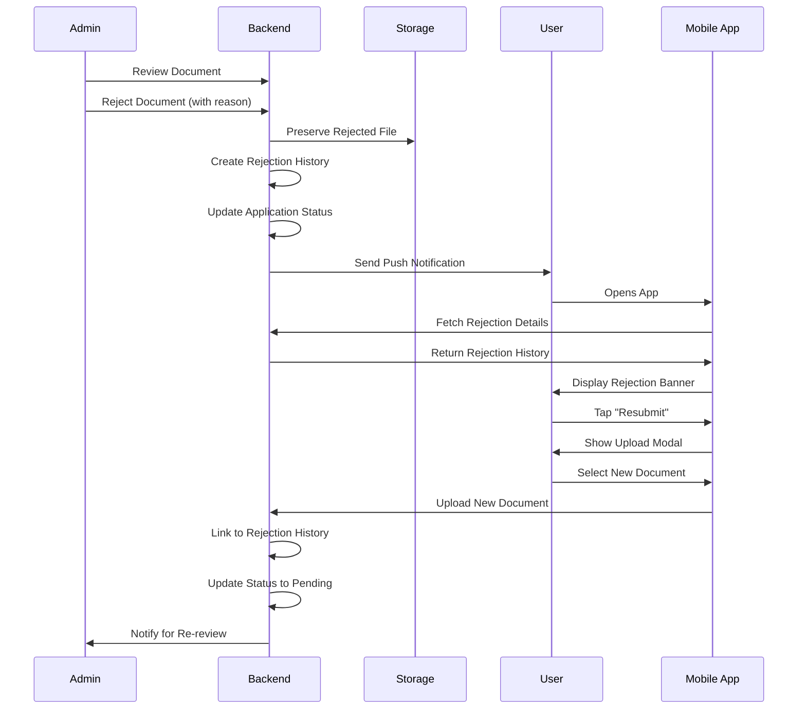

# Document Rejection History System - Implementation Plan

## 📋 Table of Contents
1. [Prerequisites](#prerequisites)
2. [Progress Tracker](#progress-tracker)
3. [Overview](#overview)
4. [System Architecture](#system-architecture)
5. [Database Schema Changes](#database-schema-changes)
6. [Backend Implementation](#backend-implementation)
7. [Frontend Implementation](#frontend-implementation)
8. [User Flow](#user-flow)
9. [UI/UX Design](#uiux-design)
10. [Testing Strategy](#testing-strategy)
11. [Rollback Plan](#rollback-plan)
12. [Timeline](#timeline)

## Prerequisites

### 🔧 Environment Setup
Before starting implementation, ensure the following:

#### Create Feature Branch
```bash
# From the project root directory
cd C:\Em

# Ensure you're on master and it's up to date
git checkout master
git pull origin master

# Create and checkout the feature branch
git checkout -b document-rejection-history

# Push the branch to remote
git push -u origin document-rejection-history
```

#### Pre-Implementation Checklist
- [ ] Review current `documentUploads` table structure
- [ ] Backup current database schema
- [ ] Document current document upload flow
- [ ] Identify all places where documents are referenced
- [ ] Review admin panel document review process
- [ ] Check current notification implementation
- [ ] Verify storage service configuration

## Progress Tracker

### 📊 Overall Progress: 0/95 Tasks Completed

### Phase 1: Database & Backend Setup (0/25)

#### Schema Updates
- [ ] Create backup of current schema.ts
- [ ] Add `documentRejectionHistory` table definition
- [ ] Add all required fields to rejection history table
- [ ] Add indexes for rejection history table
- [ ] Update `applicationStatus` enum with "Documents Need Revision"
- [ ] Run schema validation locally
- [ ] Deploy schema changes to development environment
- [ ] Verify schema deployment in Convex dashboard
- [ ] Run typecheck to fix any issue/errors

#### Backend Mutations
- [ ] Create `backend/convex/admin/documents/` directory
- [ ] Implement `rejectDocument.ts` mutation
- [ ] Add admin permission checks in rejection mutation
- [ ] Implement rejection history creation logic
- [ ] Add notification trigger in rejection mutation
- [ ] Create `backend/convex/requirements/resubmitDocument.ts`
- [ ] Implement document resubmission logic
- [ ] Add user ownership verification in resubmission
- [ ] Implement rejection history update on resubmission
- [ ] Add application status update logic
- [ ] Run typecheck to fix any issue/errors

#### Backend Queries
- [ ] Create `backend/convex/documents/rejectionQueries.ts`
- [ ] Implement `getRejectionHistory` query
- [ ] Implement `getRejectedDocumentsCount` query
- [ ] Implement `getDocumentRejectionDetails` query
- [ ] Implement `getResubmissionQueue` admin query
- [ ] Add proper authorization to all queries
- [ ] Test all queries in Convex dashboard
- [ ] Run typecheck to fix any issue/errors

### Phase 2: Frontend Types & Entities (0/12)

#### Entity Updates
- [ ] Create `src/entities/document/model/rejection-types.ts`
- [ ] Define `RejectionHistory` interface
- [ ] Define `RejectionCategory` enum
- [ ] Define `DocumentStatus` enum
- [ ] Update existing `Document` type to include rejection status
- [ ] Create rejection-related constants
- [ ] Export all new types from entity index
- [ ] Run typecheck to fix any issue/errors

#### API Integration
- [ ] Create `src/entities/document/api/rejection.ts`
- [ ] Implement rejection API calls wrapper
- [ ] Add type-safe API functions
- [ ] Create error handling for rejection APIs
- [ ] Test API integration with backend
- [ ] Run typecheck to fix any issue/errors

### Phase 3: Frontend Features (0/20)

#### Document Rejection Feature
- [ ] Create `src/features/document-rejection/` directory
- [ ] Create `ui/RejectionBanner.tsx` component
- [ ] Create `ui/RejectionBanner.styles.ts`
- [ ] Create `ui/RejectionDetails.tsx` component
- [ ] Create `ui/RejectionDetails.styles.ts`
- [ ] Create `hooks/useRejectionHistory.ts`
- [ ] Implement rejection history fetching logic
- [ ] Create feature index.ts with exports
- [ ] Add loading and error states
- [ ] Test rejection display components
- [ ] Run typecheck to fix any issue/errors

#### Document Resubmit Feature
- [ ] Create `src/features/document-resubmit/` directory
- [ ] Create `ui/ResubmitModal.tsx` component
- [ ] Create `ui/ResubmitModal.styles.ts`
- [ ] Create `hooks/useDocumentResubmit.ts`
- [ ] Implement file upload logic for resubmission
- [ ] Add progress tracking for upload
- [ ] Create success/error feedback
- [ ] Link resubmission to rejection history
- [ ] Test resubmission flow
- [ ] Create feature index.ts with exports
- [ ] Run typecheck to fix any issue/errors

### Phase 4: Widgets & Screens (0/15)

#### Rejection Widget
- [ ] Create `src/widgets/document-rejection-widget/` directory
- [ ] Create `DocumentRejectionWidget.tsx`
- [ ] Create `DocumentRejectionWidget.styles.ts`
- [ ] Implement rejection reason display
- [ ] Add specific issues list rendering
- [ ] Implement action buttons (resubmit, details)
- [ ] Add attempt number display
- [ ] Create widget index.ts
- [ ] Test widget with mock data
- [ ] Run typecheck to fix any issue/errors

#### Rejection History Screen
- [ ] Create `src/screens/shared/DocumentRejectionHistoryScreen/` directory
- [ ] Create `DocumentRejectionHistoryScreen.tsx`
- [ ] Create `DocumentRejectionHistoryScreen.styles.ts`
- [ ] Implement timeline view
- [ ] Add filtering by category/date
- [ ] Create screen index.ts
- [ ] Run typecheck to fix any issue/errors

### Phase 5: Integration with Existing Screens (0/10)

#### Update Document Upload Step
- [ ] Modify `UploadDocumentsStep.tsx`
- [ ] Add rejection status indicators
- [ ] Update styles for rejected documents
- [ ] Add tap handler for rejected documents
- [ ] Show rejection count in header
- [ ] Run typecheck to fix any issue/errors

#### Update Application Details
- [ ] Add rejection history section
- [ ] Show documents needing revision
- [ ] Add quick resubmit actions
- [ ] Update status display for "Documents Need Revision"
- [ ] Test integration with existing flow
- [ ] Run typecheck to fix any issue/errors

### Phase 6: Notifications (0/8)

#### Push Notification Setup
- [ ] Add `DOCUMENT_REJECTED` notification type
- [ ] Update notification handler
- [ ] Create notification template
- [ ] Add deep link to rejection details
- [ ] Test push notification delivery
- [ ] Run typecheck to fix any issue/errors

#### In-App Notifications
- [ ] Update notification list to show rejections
- [ ] Add rejection icon and styling
- [ ] Test notification navigation
- [ ] Run typecheck to fix any issue/errors

### Phase 7: Testing (0/10)

#### Unit Tests
- [ ] Write tests for rejection mutation
- [ ] Write tests for resubmission mutation
- [ ] Write tests for rejection queries
- [ ] Write tests for rejection components
- [ ] Write tests for resubmit hook

#### Integration Tests
- [ ] Test complete rejection flow
- [ ] Test resubmission flow
- [ ] Test notification delivery
- [ ] Test status updates
- [ ] Test file preservation

### Phase 8: Documentation & Deployment (0/5)

#### Documentation
- [ ] Create user guide for handling rejections
- [ ] Create admin guide for rejection process
- [ ] Document rejection categories
- [ ] Update API documentation
- [ ] Create troubleshooting guide

### Commit Strategy

Each completed phase should be committed separately:

```bash
# After completing each phase
Run typecheck to fix any issue/errors
git add .
git commit -m "feat(rejection-system): [Phase X] - Description"
git push origin document-rejection-history

# Example commits:
# feat(rejection-system): [Phase 1] - Add database schema and backend mutations
# feat(rejection-system): [Phase 2] - Add frontend types and entities
# feat(rejection-system): [Phase 3] - Implement rejection and resubmit features
# feat(rejection-system): [Phase 4] - Create rejection widget and history screen
# feat(rejection-system): [Phase 5] - Integrate with existing screens
# feat(rejection-system): [Phase 6] - Add rejection notifications
# feat(rejection-system): [Phase 7] - Add comprehensive tests
# feat(rejection-system): [Phase 8] - Add documentation and finalize
```

### Merge Strategy

Once all tasks are complete:

```bash
# Ensure all tests pass
npm run test
npm run typecheck
npm run lint

## Overview

### Purpose
Implement a comprehensive document rejection history system that preserves rejected documents for audit trail while allowing users to resubmit corrected documents.

### Key Features
- Preserve rejected documents permanently for audit trail
- Track rejection reasons and categories
- Allow document resubmission without losing history
- Provide clear feedback to users about rejections
- Enable admin review of rejection patterns

### Success Metrics
- Zero data loss of rejected documents
- 90% reduction in support tickets about rejected documents
- < 48 hour average resubmission time
- 100% audit trail compliance

## System Architecture

### Data Flow


### Component Architecture Following FSD
```
src/
├── entities/           # Business entities
│   └── document/
│       ├── model/
│       │   ├── types.ts (ADD: RejectionHistory type)
│       │   └── constants.ts (ADD: RejectionCategory enum)
│       └── api/
│           └── rejection.ts (NEW: Rejection API calls)
│
├── features/          # User-facing features
│   ├── document-rejection/ (NEW)
│   │   ├── ui/
│   │   │   ├── RejectionBanner.tsx
│   │   │   └── RejectionDetails.tsx
│   │   ├── hooks/
│   │   │   └── useRejectionHistory.ts
│   │   └── index.ts
│   │
│   └── document-resubmit/ (NEW)
│       ├── ui/
│       │   └── ResubmitModal.tsx
│       ├── hooks/
│       │   └── useDocumentResubmit.ts
│       └── index.ts
│
├── widgets/           # Complex UI blocks
│   └── document-rejection-widget/ (NEW)
│       ├── DocumentRejectionWidget.tsx
│       ├── DocumentRejectionWidget.styles.ts
│       └── index.ts
│
└── screens/          # Screen components
    └── shared/
        └── DocumentRejectionHistoryScreen/ (NEW)
            ├── DocumentRejectionHistoryScreen.tsx
            ├── DocumentRejectionHistoryScreen.styles.ts
            └── index.ts
```

## Database Schema Changes

### 1. Add New Table: `documentRejectionHistory`

```typescript
// backend/convex/schema.ts - ADD THIS TABLE

documentRejectionHistory: defineTable({
  // Core References
  applicationId: v.id("applications"),
  documentTypeId: v.id("documentTypes"),
  documentUploadId: v.id("documentUploads"), // Original upload
  
  // Preserved File Data
  rejectedFileId: v.id("_storage"), // Never delete this
  originalFileName: v.string(),
  fileSize: v.float64(),
  fileType: v.string(),
  
  // Rejection Information
  rejectionCategory: v.union(
    v.literal("quality_issue"),      // Blurry, dark, unreadable
    v.literal("wrong_document"),     // Incorrect document type
    v.literal("expired_document"),   // Document past validity
    v.literal("incomplete_document"), // Missing pages/information
    v.literal("invalid_document"),   // Fake or tampered
    v.literal("format_issue"),       // Wrong format/size
    v.literal("other")               // Other reasons
  ),
  rejectionReason: v.string(), // Detailed explanation
  specificIssues: v.array(v.string()), // Bullet points
  
  // Tracking
  rejectedBy: v.id("users"), // Admin who rejected
  rejectedAt: v.float64(),
  
  // Resubmission Tracking
  wasReplaced: v.boolean(),
  replacementUploadId: v.optional(v.id("documentUploads")),
  replacedAt: v.optional(v.float64()),
  attemptNumber: v.number(), // 1st, 2nd, 3rd attempt
  
  // Audit Fields
  ipAddress: v.optional(v.string()),
  userAgent: v.optional(v.string()),
})
.index("by_application", ["applicationId"])
.index("by_document_type", ["applicationId", "documentTypeId"])
.index("by_rejected_at", ["rejectedAt"])
.index("by_admin", ["rejectedBy"])
.index("by_replacement", ["wasReplaced"]),
```

### 2. Update Application Status Enum

```typescript
// backend/convex/schema.ts - UPDATE

applicationStatus: v.union(
  v.literal("Draft"),
  v.literal("Pending Payment"),
  v.literal("Submitted"),
  v.literal("Documents Need Revision"), // NEW STATUS
  v.literal("Under Review"),
  v.literal("For Payment Validation"),
  v.literal("Approved"),
  v.literal("Rejected")
),
```

## Backend Implementation

### 1. Document Rejection Mutation

```typescript
// backend/convex/admin/documents/rejectDocument.ts (NEW FILE)

import { mutation } from "../../_generated/server";
import { v } from "convex/values";

export const rejectDocument = mutation({
  args: {
    documentUploadId: v.id("documentUploads"),
    rejectionCategory: v.union(
      v.literal("quality_issue"),
      v.literal("wrong_document"),
      v.literal("expired_document"),
      v.literal("incomplete_document"),
      v.literal("invalid_document"),
      v.literal("format_issue"),
      v.literal("other")
    ),
    rejectionReason: v.string(),
    specificIssues: v.array(v.string()),
  },
  handler: async (ctx, args) => {
    // Implementation as detailed in previous section
    // Key steps:
    // 1. Verify admin permissions
    // 2. Get document and application details
    // 3. Create rejection history record
    // 4. Update document status
    // 5. Update application status to "Documents Need Revision"
    // 6. Send notification to user
    // 7. Return success with rejection ID
  },
});
```

### 2. Document Resubmission Mutation

```typescript
// backend/convex/requirements/resubmitDocument.ts (NEW FILE)

export const resubmitDocument = mutation({
  args: {
    applicationId: v.id("applications"),
    documentTypeId: v.id("documentTypes"),
    storageId: v.id("_storage"),
    fileName: v.string(),
    fileType: v.string(),
    fileSize: v.number(),
  },
  handler: async (ctx, args) => {
    // Implementation steps:
    // 1. Verify user ownership
    // 2. Find rejected document
    // 3. Create new document upload
    // 4. Update rejection history
    // 5. Delete old rejected upload record
    // 6. Check if all docs are now pending/approved
    // 7. Update application status if needed
  },
});
```

### 3. Query Functions

```typescript
// backend/convex/documents/rejectionQueries.ts (NEW FILE)

export const getRejectionHistory = query({
  args: {
    applicationId: v.id("applications"),
  },
  handler: async (ctx, args) => {
    // Return enriched rejection history
  },
});

export const getRejectedDocumentsCount = query({
  args: {
    userId: v.id("users"),
  },
  handler: async (ctx, args) => {
    // Return count for badge display
  },
});
```

## Frontend Implementation

### 1. Entity Types

```typescript
// apps/mobile/src/entities/document/model/types.ts (UPDATE)

export interface RejectionHistory {
  _id: Id<"documentRejectionHistory">;
  applicationId: Id<"applications">;
  documentTypeId: Id<"documentTypes">;
  documentUploadId: Id<"documentUploads">;
  rejectedFileId: Id<"_storage">;
  originalFileName: string;
  fileSize: number;
  fileType: string;
  rejectionCategory: RejectionCategory;
  rejectionReason: string;
  specificIssues: string[];
  rejectedBy: Id<"users">;
  rejectedAt: number;
  wasReplaced: boolean;
  replacementUploadId?: Id<"documentUploads">;
  replacedAt?: number;
  attemptNumber: number;
}

export enum RejectionCategory {
  QUALITY_ISSUE = "quality_issue",
  WRONG_DOCUMENT = "wrong_document",
  EXPIRED_DOCUMENT = "expired_document",
  INCOMPLETE_DOCUMENT = "incomplete_document",
  INVALID_DOCUMENT = "invalid_document",
  FORMAT_ISSUE = "format_issue",
  OTHER = "other",
}

export enum DocumentStatus {
  PENDING = "Pending",
  APPROVED = "Approved",
  REJECTED = "Rejected",
  RESUBMITTED = "Resubmitted",
}
```

### 2. Rejection Display Widget

```typescript
// apps/mobile/src/widgets/document-rejection/DocumentRejectionWidget.tsx (NEW)

import React from 'react';
import { View, Text, TouchableOpacity } from 'react-native';
import { Ionicons } from '@expo/vector-icons';
import { styles } from './DocumentRejectionWidget.styles';
import { theme } from '@shared/styles/theme';
import { moderateScale } from '@shared/utils/responsive';

interface DocumentRejectionWidgetProps {
  rejection: RejectionHistory;
  onResubmit: () => void;
  onViewDetails: () => void;
}

export function DocumentRejectionWidget({ 
  rejection, 
  onResubmit, 
  onViewDetails 
}: DocumentRejectionWidgetProps) {
  return (
    <View style={styles.container}>
      {/* Rejection Banner */}
      <View style={styles.rejectionBanner}>
        <Ionicons 
          name="close-circle" 
          size={moderateScale(24)} 
          color={theme.colors.semantic.error} 
        />
        <Text style={styles.rejectionTitle}>Document Rejected</Text>
        <Text style={styles.attemptBadge}>
          Attempt #{rejection.attemptNumber}
        </Text>
      </View>

      {/* Rejection Reason */}
      <View style={styles.reasonSection}>
        <Text style={styles.reasonTitle}>Reason:</Text>
        <Text style={styles.reasonText}>{rejection.rejectionReason}</Text>
      </View>

      {/* Specific Issues */}
      {rejection.specificIssues.length > 0 && (
        <View style={styles.issuesSection}>
          <Text style={styles.issuesTitle}>Issues to Address:</Text>
          {rejection.specificIssues.map((issue, index) => (
            <View key={index} style={styles.issueItem}>
              <Ionicons 
                name="alert-circle-outline" 
                size={moderateScale(16)} 
                color={theme.colors.accent.warningOrange} 
              />
              <Text style={styles.issueText}>{issue}</Text>
            </View>
          ))}
        </View>
      )}

      {/* Action Buttons */}
      <View style={styles.actionButtons}>
        <TouchableOpacity 
          style={styles.resubmitButton}
          onPress={onResubmit}
        >
          <Ionicons 
            name="cloud-upload-outline" 
            size={moderateScale(20)} 
            color="white" 
          />
          <Text style={styles.resubmitButtonText}>
            Upload New Document
          </Text>
        </TouchableOpacity>

        <TouchableOpacity 
          style={styles.detailsButton}
          onPress={onViewDetails}
        >
          <Text style={styles.detailsButtonText}>View Details</Text>
        </TouchableOpacity>
      </View>
    </View>
  );
}
```

### 3. Resubmission Hook

```typescript
// apps/mobile/src/features/document-resubmit/hooks/useDocumentResubmit.ts (NEW)

import { useMutation } from 'convex/react';
import { api } from '@backend/convex/_generated/api';
import { useState } from 'react';
import { FeedbackSystem } from '@shared/components/feedback/feedback';

export function useDocumentResubmit() {
  const [isSubmitting, setIsSubmitting] = useState(false);
  const resubmitMutation = useMutation(api.requirements.resubmitDocument);

  const resubmitDocument = async (params: {
    applicationId: Id<"applications">;
    documentTypeId: Id<"documentTypes">;
    file: DocumentPickerAsset;
  }) => {
    setIsSubmitting(true);
    try {
      // 1. Upload file to storage
      const storageId = await uploadToStorage(params.file);
      
      // 2. Call resubmit mutation
      await resubmitMutation({
        applicationId: params.applicationId,
        documentTypeId: params.documentTypeId,
        storageId,
        fileName: params.file.name,
        fileType: params.file.mimeType,
        fileSize: params.file.size,
      });
      
      FeedbackSystem.showSuccess('Document resubmitted successfully');
      return { success: true };
    } catch (error) {
      FeedbackSystem.showError('Failed to resubmit document');
      return { success: false, error };
    } finally {
      setIsSubmitting(false);
    }
  };

  return {
    resubmitDocument,
    isSubmitting,
  };
}
```

### 4. Updated Document Upload Step

```typescript
// apps/mobile/src/features/application/components/steps/UploadDocumentsStep/UploadDocumentsStep.tsx (UPDATE)

// Add rejection indicator to document items
const DocumentItem = ({ document, rejection }) => {
  const hasRejection = !!rejection && !rejection.wasReplaced;
  
  return (
    <View style={[
      styles.documentItem,
      hasRejection && styles.documentItemRejected
    ]}>
      {hasRejection && (
        <View style={styles.rejectionIndicator}>
          <Ionicons 
            name="exclamation-circle" 
            size={moderateScale(20)} 
            color={theme.colors.semantic.error} 
          />
          <Text style={styles.rejectionLabel}>Rejected</Text>
        </View>
      )}
      {/* Rest of document item UI */}
    </View>
  );
};
```

## User Flow

### Document Rejection Flow


## UI/UX Design

### Visual Indicators

#### Rejected Document Card
```
┌─────────────────────────────────────────┐
│ 🔴 Valid ID - REJECTED                  │
│                                          │
│ ⚠️ Issues to fix:                       │
│ • Image is too blurry                   │
│ • Text is not readable                  │
│                                          │
│ Rejected: Oct 3, 2024                   │
│ By: Admin John                          │
│                                          │
│ ┌───────────────────────┐                │
│ │  📤 Upload New File   │                │
│ └───────────────────────┘                │
└─────────────────────────────────────────┘
```

#### Rejection Notification
```
┌─────────────────────────────────────────┐
│ 🔴 Document Rejected                    │
│                                          │
│ Your Valid ID has been rejected.        │
│ Tap to see details and resubmit.        │
│                                          │
│ 2 minutes ago                           │
└─────────────────────────────────────────┘
```

### Color Scheme
- **Error State**: `theme.colors.semantic.error` (#EF4444)
- **Warning**: `theme.colors.accent.warningOrange` (#F18F01)
- **Success**: `theme.colors.accent.safetyGreen` (#28A745)
- **Info**: `theme.colors.accent.medicalBlue` (#2E86AB)

### Responsive Scaling
All UI elements use the project's responsive utilities:
- `scale()` for horizontal spacing
- `verticalScale()` for vertical spacing
- `moderateScale()` for fonts and other elements

## Testing Strategy

### Unit Tests

```typescript
// __tests__/rejection-history.test.ts

describe('Document Rejection History', () => {
  test('should create rejection history when document is rejected', async () => {
    // Test mutation creates history record
  });
  
  test('should preserve file when document is rejected', async () => {
    // Verify file is not deleted
  });
  
  test('should link resubmission to rejection history', async () => {
    // Test resubmission updates history
  });
});
```

### Integration Tests

```typescript
// __tests__/rejection-flow.integration.test.ts

describe('Document Rejection Flow', () => {
  test('complete rejection and resubmission flow', async () => {
    // 1. Admin rejects document
    // 2. User receives notification
    // 3. User views rejection details
    // 4. User resubmits document
    // 5. Verify history is maintained
  });
});
```

### E2E Tests

```typescript
// e2e/rejection.e2e.ts

describe('Document Rejection E2E', () => {
  it('should handle document rejection end-to-end', async () => {
    // Test complete user journey
  });
});
```

## Rollback Plan

### If Issues Occur:

1. **Database Rollback**
   - Keep backup of schema before changes
   - Prepared migration to revert schema

2. **Code Rollback**
   - Feature flagged implementation
   - Can disable via environment variable

3. **Data Recovery**
   - All rejected files preserved in storage
   - Can reconstruct from audit logs

## Timeline

### Phase 1: Backend (Week 1)
- Day 1-2: Schema updates and migrations
- Day 3-4: Rejection mutations and queries
- Day 5: Backend testing

### Phase 2: Frontend Core (Week 2)
- Day 1-2: Entity types and hooks
- Day 3-4: Rejection widgets and components
- Day 5: Integration with existing screens

### Phase 3: User Experience (Week 3)
- Day 1-2: Notification system updates
- Day 3-4: Rejection history screen
- Day 5: UI polish and animations

### Phase 4: Testing & Launch (Week 4)
- Day 1-2: Comprehensive testing
- Day 3: Bug fixes and optimization
- Day 4: Documentation
- Day 5: Production deployment

## Implementation Checklist

### Backend
- [ ] Add `documentRejectionHistory` table to schema
- [ ] Create rejection mutation
- [ ] Create resubmission mutation
- [ ] Create query functions
- [ ] Add notification triggers
- [ ] Update application status flow
- [ ] Implement file preservation logic
- [ ] Add admin endpoints

### Frontend
- [ ] Update document entity types
- [ ] Create rejection display widget
- [ ] Implement resubmission feature
- [ ] Update document list screen
- [ ] Add rejection indicators
- [ ] Create rejection history screen
- [ ] Implement push notifications
- [ ] Add deep linking

### Testing
- [ ] Unit tests for mutations
- [ ] Integration tests for flow
- [ ] E2E tests for user journey
- [ ] Performance testing
- [ ] Security testing

### Documentation
- [ ] API documentation
- [ ] User guide
- [ ] Admin guide
- [ ] Rejection category guide
- [ ] Troubleshooting guide

## Security Considerations

1. **File Access Control**
   - Rejected files only accessible by owner and admin
   - Implement proper authorization checks

2. **Data Privacy**
   - Anonymize rejection data for analytics
   - Implement data retention policies

3. **Audit Trail**
   - Log all rejection actions
   - Maintain complete history chain
   - Regular audit reports

## Performance Considerations

1. **Storage Optimization**
   - Move old rejected files to archive storage after 90 days
   - Compress rejected files if not accessed for 30 days

2. **Query Optimization**
   - Index by application ID and document type
   - Paginate rejection history queries
   - Cache frequently accessed rejections

3. **UI Performance**
   - Lazy load rejection details
   - Optimize image previews
   - Use React.memo for rejection components

## Monitoring & Analytics

### Key Metrics to Track
- Document rejection rate by category
- Average time to resubmission
- Success rate after resubmission
- Most common rejection reasons
- Admin rejection patterns

### Alerts to Set Up
- High rejection rate alert (>30%)
- Long resubmission time (>72 hours)
- Storage usage for rejected files
- Failed resubmission attempts

## Future Enhancements

1. **AI-Powered Pre-validation**
   - Check document quality before submission
   - Suggest improvements to users

2. **Bulk Operations**
   - Allow batch rejection with same reason
   - Bulk resubmission for multiple documents

3. **Advanced Analytics**
   - Rejection pattern analysis
   - Predictive rejection modeling
   - Admin performance metrics

4. **User Education**
   - In-app tutorials for common issues
   - Sample documents for reference
   - Real-time validation feedback

---

**Document Version**: 1.0.0  
**Last Updated**: October 4, 2025  
**Author**: eMediCard Development Team  
**Status**: Ready for Implementation
