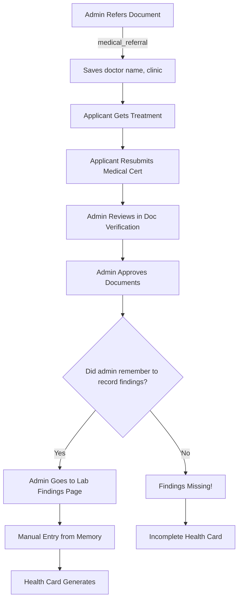
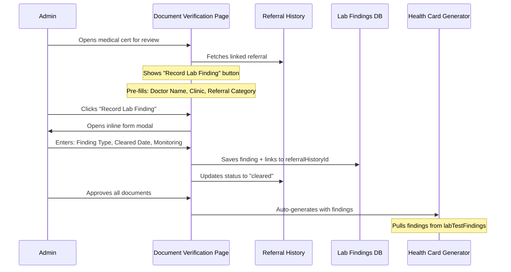

# Lab Findings Workflow Analysis & Recommendations
## 🎯 Senior Full-Stack Developer Perspective

**Author**: AI Agent (Senior Dev Mode)  
**Date**: January 15, 2025  
**Status**: Architecture Analysis & Recommendations

---

## 📋 Executive Summary

**Current Issue**: Lab Findings feature is implemented as a **standalone page** disconnected from the document verification workflow, causing awkward UX and manual entry errors.

**Root Cause**: Lab findings should be recorded **during document review**, not as a separate administrative task.

**Recommended Solution**: Integrate Lab Findings form directly into the document verification page as an inline action.

---

## 🔍 Current System Analysis

### Architecture Overview



### Current Tables & Relationships

```typescript
documentReferralHistory {
  _id: Id
  applicationId: Id
  issueType: "medical_referral"
  medicalReferralCategory: string // e.g., "elevated_urinalysis"
  doctorName: string  // ✅ ALREADY SAVED HERE!
  clinicAddress: string
  status: "pending" | "resubmitted" | "cleared"
  referralReason: string
  specificIssues: string[]
}

labTestFindings {
  _id: Id
  applicationId: Id
  testType: "urinalysis" | "xray_sputum" | "stool"
  findingKind: string
  clearedDate: number
  monitoringExpiry: number
  doctorName: string  // ❌ DUPLICATED - should reference referral!
  referralHistoryId?: Id // Optional link
  showOnCard: boolean
}
```

---

## ❌ Problems with Current Implementation

### 1. **Disconnected Workflow**
- Admin reviews medical clearance certificate in document verification
- Admin approves document
- **THEN** admin must remember to go to separate Lab Findings page
- Admin manually re-types information they just saw in the certificate
- Prone to forgetting or errors

### 2. **Redundant Data Entry**
- Doctor name already saved in `documentReferralHistory` during referral
- Admin re-enters doctor name when recording finding
- No validation that it's the same doctor who referred

### 3. **No Workflow Enforcement**
- System doesn't prevent approving applications with medical referrals but missing lab findings
- No reminder or validation

### 4. **Poor UX**
- Manual URL entry: `http://localhost:3000/dashboard/lab-findings`
- Requires admin to context-switch away from document review
- Breaks natural workflow

---

## ✅ OPTIMAL ARCHITECTURE

### Recommended Flow



### Integration Points

#### 1. **Document Verification Page Enhancement**

**Location**: `apps/webadmin/src/app/dashboard/[id]/doc_verif/page.tsx`

**Add**:
- Detect when viewing medical referral document
- Show "Record Lab Finding" button next to document review actions
- Inline modal form for recording findings
- Pre-populate doctor name from referralHistory

```typescript
// Pseudo-code
if (documentUpload.reviewStatus === "Referred" && 
    referralHistory?.issueType === "medical_referral" &&
    referralHistory.status === "resubmitted") {
  return (
    <div>
      <button onClick={() => setShowLabFindingForm(true)}>
        📋 Record Lab Finding for this Referral
      </button>
      
      {showLabFindingForm && (
        <LabFindingRecorderForm
          applicationId={applicationId}
          referralHistoryId={referralHistory._id}
          prefillDoctorName={referralHistory.doctorName}
          prefillClinicAddress={referralHistory.clinicAddress}
          onSuccess={() => {
            // Mark referral as cleared
            // Refresh document list
          }}
        />
      )}
    </div>
  )
}
```

#### 2. **Validation Before Approval**

**Location**: `backend/convex/admin/finalizeApplication.ts`

**Add**:
```typescript
// Before approving application
if (args.newStatus === "Approved") {
  // Check for medical referrals
  const medicalReferrals = await ctx.db
    .query("documentReferralHistory")
    .withIndex("by_application", q => q.eq("applicationId", args.applicationId))
    .filter(q => q.eq(q.field("issueType"), "medical_referral"))
    .collect();
  
  if (medicalReferrals.length > 0) {
    // Verify all referrals have corresponding lab findings
    for (const referral of medicalReferrals) {
      const finding = await ctx.db
        .query("labTestFindings")
        .withIndex("by_referral", q => q.eq("referralHistoryId", referral._id))
        .first();
      
      if (!finding && referral.status !== "cleared") {
        throw new Error(
          `Medical referral for ${referral.medicalReferralCategory} ` +
          `must have lab findings recorded before approval. ` +
          `Please review the resubmitted medical certificate and record the findings.`
        );
      }
    }
  }
}
```

---

## 🔧 Specific UI/UX Fixes

### Fix #1: Gray Text Colors
**Issue**: Text too light to read  
**Solution**: Change to text-gray-600 or text-gray-700

```tsx
// OLD
<label className="block text-sm font-medium text-gray-500 mb-1">

// NEW
<label className="block text-sm font-medium text-gray-700 mb-1">
```

### Fix #2: Monitoring Period - Max 1 Month
**Issue**: 12 months too long, usually just weeks  
**Reason**: City Health Officer validation typically requires recheck within 1 month

```tsx
// OLD
<select>
  <option value={3}>3 months</option>
  <option value={6}>6 months (Recommended)</option>
  <option value={12}>12 months</option>
</select>

// NEW
<select>
  <option value={0.5}>2 weeks</option>
  <option value={1}>1 month (Recommended)</option>
  <option value={3}>3 months</option>
</select>
```

**Backend Update**:
```typescript
// convex/schema.ts
monitoringPeriodMonths: v.float64(), // Allow decimal for weeks (0.5 = 2 weeks)
```

### Fix #3: Auto-fill Doctor Name
**Issue**: Doctor name should default to City Health Officer  
**Reason**: Dr. Marjorie D. Culas refers AND validates (same person)

```tsx
// Add to LabFindingRecorderForm component
const [formData, setFormData] = useState({
  ...
  doctorName: "Dr. Marjorie D. Culas", // Default to CHO
  ...
});
```

---

## 📊 Database Schema Recommendations

### Current Schema (Good)
```typescript
labTestFindings {
  referralHistoryId?: Id<"documentReferralHistory"> // ✅ Optional link exists
}
```

### Recommended Enhancement
Make `referralHistoryId` **required** for medical referrals:

```typescript
labTestFindings {
  referralHistoryId: Id<"documentReferralHistory"> // Required
  // This enforces proper workflow tracking
}
```

---

## 🚀 Implementation Phases

### Phase 1: Quick Fixes (Immediate)
1. ✅ Fix gray text colors → text-gray-700
2. ✅ Change monitoring period max to 1 month
3. ✅ Auto-fill doctor name to "Dr. Marjorie D. Culas"
4. ✅ Add validation: cannot approve with pending medical referrals missing findings

### Phase 2: Workflow Integration (Next Sprint)
1. Add "Record Lab Finding" button in document verification page
2. Show button only when viewing resubmitted medical referral documents
3. Inline modal form with pre-filled doctor info
4. Auto-link finding to referralHistoryId
5. Mark referral as "cleared" when finding recorded

### Phase 3: Enhanced Validation (Future)
1. Prevent application approval if medical referrals lack findings
2. Show warnings/reminders during document review
3. Dashboard indicators for applications with pending medical clearances

---

## 💡 Why This Flow is Better

### For Admins:
✅ Natural workflow - record findings while reviewing certificate  
✅ Less manual typing - doctor info pre-filled  
✅ No forgetting - button visible right when needed  
✅ Faster approval process  

### For System:
✅ Data integrity - findings always linked to referrals  
✅ Audit trail - know which referral was cleared  
✅ Validation - can't approve without findings  

### For Applicants:
✅ Faster processing - no admin delays from forgotten entries  
✅ Accurate health cards - findings properly recorded  
✅ Transparent status - can see when findings recorded  

---

## 🎯 System Architect Recommendation

**VERDICT**: Current standalone Lab Findings page should be **supplementary**, not primary.

**Primary Flow**: Integrate into document verification (Phase 2)  
**Secondary Flow**: Keep existing page for corrections/additions

**Rationale**: Context is king. When an admin sees a medical clearance certificate, that's the EXACT moment they should record the finding - not 5 minutes later on a different page.

---

## 📝 Mobile App Impact

**IMPORTANT**: NO changes needed to mobile app!

**Why**: Lab findings are admin-side only. Mobile app just views the generated health card with findings already included.

**What Mobile Team Needs to Know**:
- Health cards will now have lab findings populated
- Findings appear in URINALYSIS, X-RAY/SPUTUM, STOOL sections on card back
- Format: Date | Finding | Expiry Date

---

## ✅ Approval Checklist (for Team Lead)

Before merging Lab Findings feature:

- [ ] Quick fixes applied (colors, monitoring period, auto-fill)
- [ ] Validation added: prevent approval without findings
- [ ] Document verification integration planned for next sprint
- [ ] Mobile team notified of health card changes
- [ ] Test scenarios documented
- [ ] User training material updated

---

**Questions? Contact**: Development Team  
**Last Updated**: January 15, 2025
